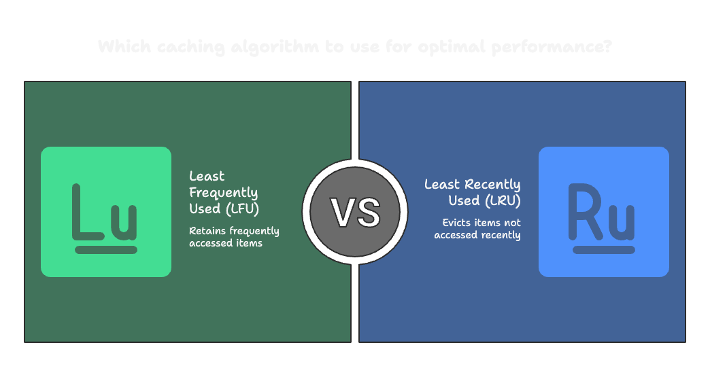

# LRU vs LFU Redis Demo 

Everyone defaults to LRU caching, but when bots create 500,000 sessions per hour, LFU is your best friend.

Frank wrote up a detailed description of why you should consider using an [LFU cache for user sessions](https://www.revsys.com/tidbits/sometimes-lfu-lru/). 

# Quick Video Explanation 

## Which cache algorithm is right for you? 

